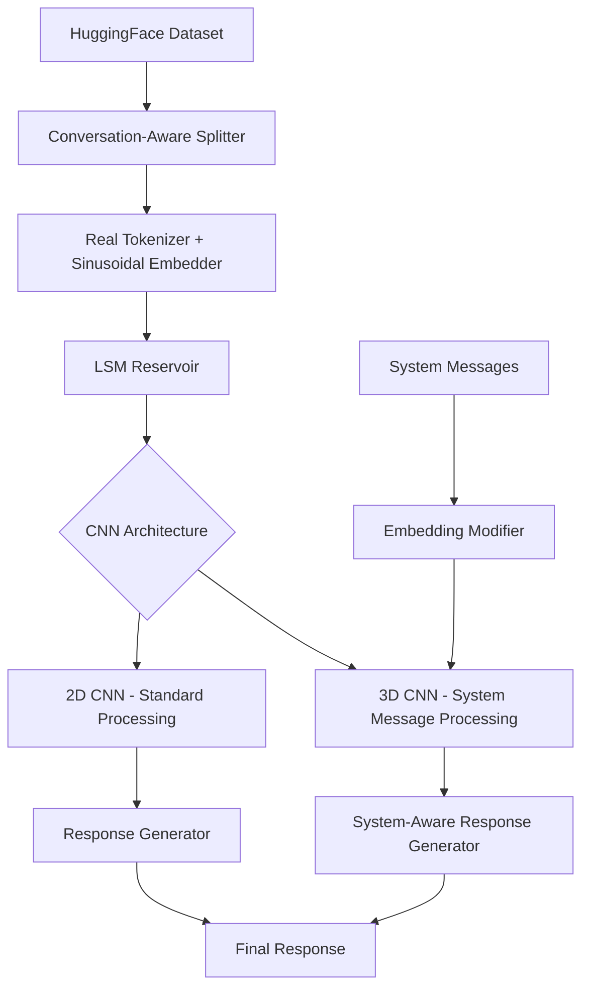

# Design Document

## Overview

The LSM Training Pipeline Enhancement transforms the current token-level prediction system into a sophisticated conversational AI pipeline. The design integrates real-world datasets from HuggingFace, implements sinusoidally-optimized embeddings, extends CNN architectures to support 3D processing for system messages, and transitions from iterative token generation to complete response generation.

The enhanced system maintains the core LSM architecture (sparse sine-activated reservoirs) while adding multiple processing layers: dataset integration, advanced tokenization, multi-dimensional CNN processing, and response-level inference with system message support.

## Architecture

### High-Level System Flow



### Data Flow Architecture

1. **Dataset Layer**: HuggingFace cosmopedia-v2 dataset integration with conversation-aware splitting
2. **Tokenization Layer**: Standard tokenizer with custom sinusoidal embedding optimization
3. **Reservoir Layer**: Existing sparse sine-activated LSM with enhanced output handling
4. **CNN Processing Layer**: Dual 2D/3D CNN architecture for standard and system-aware processing
5. **Response Generation Layer**: Complete response inference replacing token-by-token generation
6. **System Integration Layer**: System message processing and embedding modification

## Components and Interfaces

### 1. HuggingFace Dataset Integration Component

**Purpose**: Download, cache, and process conversational datasets from HuggingFace

**Key Classes**:
- `HuggingFaceDatasetLoader`: Handles dataset downloading and caching
- `ConversationSplitter`: Splits data by complete conversations rather than windows
- `DatasetProcessor`: Processes and validates downloaded data

**Interfaces**:
```python
class HuggingFaceDatasetLoader:
    def download_cosmopedia_csvs(self, cache_dir: str) -> List[str]
    def load_cached_datasets(self, cache_dir: str) -> pd.DataFrame
    def validate_dataset_integrity(self, df: pd.DataFrame) -> bool

class ConversationSplitter:
    def split_by_conversation(self, df: pd.DataFrame, test_ratio: float) -> Tuple[pd.DataFrame, pd.DataFrame]
    def identify_conversation_boundaries(self, df: pd.DataFrame) -> List[int]
    def ensure_conversation_integrity(self, train_df: pd.DataFrame, test_df: pd.DataFrame) -> bool
```

### 2. Advanced Tokenization and Embedding System

**Purpose**: Replace custom tokenizer with standard tokenizer and implement sinusoidally-optimized embeddings

**Key Classes**:
- `StandardTokenizerWrapper`: Wraps standard tokenizers (e.g., GPT-2, BERT tokenizer)
- `SinusoidalEmbedder`: Creates embeddings optimized for sinusoidal patterns
- `EmbeddingOptimizer`: Fits embeddings to maximize sinusoidality

**Interfaces**:
```python
class StandardTokenizerWrapper:
    def __init__(self, tokenizer_name: str)
    def tokenize(self, texts: List[str]) -> List[List[int]]
    def decode(self, token_ids: List[int]) -> str
    def get_vocab_size(self) -> int

class SinusoidalEmbedder:
    def __init__(self, vocab_size: int, embedding_dim: int)
    def fit_sinusoidal_patterns(self, training_data: np.ndarray) -> None
    def embed(self, token_ids: List[int]) -> np.ndarray
    def optimize_for_sine_activation(self, reservoir_outputs: np.ndarray) -> None
```

### 3. Enhanced CNN Architecture System

**Purpose**: Support both 2D and 3D CNN models with different processing capabilities

**Key Classes**:
- `CNNArchitectureFactory`: Creates appropriate CNN models based on requirements
- `CNN2DProcessor`: Handles standard 2D CNN processing
- `CNN3DProcessor`: Handles 3D CNN processing with system message integration
- `LossCalculator`: Implements cosine similarity loss for response-level training

**Interfaces**:
```python
class CNNArchitectureFactory:
    def create_2d_cnn(self, input_shape: Tuple, use_attention: bool) -> tf.keras.Model
    def create_3d_cnn(self, input_shape: Tuple, system_dim: int) -> tf.keras.Model
    def create_residual_cnn(self, input_shape: Tuple, depth: int) -> tf.keras.Model

class CNN3DProcessor:
    def process_with_system_context(self, reservoir_output: np.ndarray, system_embeddings: np.ndarray) -> np.ndarray
    def integrate_embedding_modifiers(self, base_output: np.ndarray, modifiers: np.ndarray) -> np.ndarray
```

### 4. Response-Level Inference System

**Purpose**: Generate complete responses instead of iterative token prediction

**Key Classes**:
- `ResponseGenerator`: Main response generation orchestrator
- `TokenSequenceProcessor`: Processes sequences of token embeddings
- `ResponseInferenceModel`: Secondary model for complete response prediction
- `ReservoirManager`: Manages reservoir reuse vs. separate reservoir creation

**Interfaces**:
```python
class ResponseGenerator:
    def generate_complete_response(self, input_sequence: np.ndarray) -> str
    def process_token_embeddings_sequence(self, embeddings: List[np.ndarray]) -> np.ndarray
    def determine_reservoir_strategy(self) -> str  # 'reuse' or 'separate'

class ResponseInferenceModel:
    def __init__(self, input_dim: int, output_vocab_size: int)
    def predict_response(self, token_embedding_sequence: np.ndarray) -> np.ndarray
    def train_on_response_pairs(self, inputs: np.ndarray, targets: np.ndarray) -> None
```

### 5. System Message Integration System

**Purpose**: Process system messages and integrate them into response generation

**Key Classes**:
- `SystemMessageProcessor`: Handles system message parsing and processing
- `EmbeddingModifierGenerator`: Creates embedding modifiers from system prompts
- `SystemReservoir`: Separate reservoir for system message processing (if needed)
- `SystemAwareCNN`: 3D CNN that integrates system context

**Interfaces**:
```python
class SystemMessageProcessor:
    def parse_system_message(self, message: str) -> Dict[str, Any]
    def create_system_context(self, message: str) -> np.ndarray
    def validate_system_message_format(self, message: str) -> bool

class EmbeddingModifierGenerator:
    def __init__(self, system_embedding_dim: int)
    def generate_modifiers(self, system_prompt: str) -> np.ndarray
    def train_modifier_model(self, system_prompts: List[str], target_behaviors: List[np.ndarray]) -> None
```

### 6. Message Annotation and Pipeline System

**Purpose**: Add message annotations and create modular pipeline architecture

**Key Classes**:
- `MessageAnnotator`: Adds annotations to messages
- `PipelineOrchestrator`: Manages the complete processing pipeline
- `ColabCompatibilityManager`: Ensures easy deployment to Google Colab
- `ArchitectureExperimenter`: Supports easy swapping of model components

**Interfaces**:
```python
class MessageAnnotator:
    def annotate_message(self, message: str, message_type: str) -> str
    def add_conversation_markers(self, conversation: List[str]) -> List[str]
    def parse_annotated_message(self, annotated_message: str) -> Dict[str, str]

class PipelineOrchestrator:
    def setup_pipeline(self, config: Dict[str, Any]) -> None
    def process_input(self, input_data: Any) -> str
    def swap_component(self, component_name: str, new_component: Any) -> None
```

## Data Models

### Core Data Structures

```python
@dataclass
class ConversationData:
    conversation_id: str
    turns: List[str]
    participants: List[str]
    metadata: Dict[str, Any]
    annotations: Dict[str, str]

@dataclass
class ProcessedSequence:
    input_embeddings: np.ndarray  # Shape: (sequence_length, embedding_dim)
    target_response: str
    conversation_context: ConversationData
    system_message: Optional[str] = None

@dataclass
class ModelConfiguration:
    # Existing fields...
    tokenizer_type: str
    embedding_optimization: str
    cnn_architecture: str  # '2d', '3d', or 'hybrid'
    response_generation_mode: str  # 'token' or 'response'
    system_message_support: bool
    loss_function: str  # 'mse', 'cosine_similarity'

@dataclass
class SystemMessageConfig:
    message: str
    modifier_weights: np.ndarray
    processing_mode: str  # '3d_cnn', 'separate_reservoir'
    influence_strength: float

@dataclass
class ResponseGenerationResult:
    generated_response: str
    confidence_score: float
    processing_time: float
    intermediate_embeddings: List[np.ndarray]
    system_influence: Optional[float] = None
```

### Enhanced Training Data Structure

```python
@dataclass
class EnhancedTrainingBatch:
    input_sequences: np.ndarray  # Shape: (batch_size, seq_len, embedding_dim)
    target_responses: List[str]  # Complete responses, not just next tokens
    conversation_contexts: List[ConversationData]
    system_messages: Optional[List[str]] = None
    embedding_modifiers: Optional[np.ndarray] = None
```

## Error Handling

### Exception Hierarchy

```python
class LSMEnhancementError(LSMError):
    """Base exception for LSM enhancement features"""
    pass

class DatasetIntegrationError(LSMEnhancementError):
    """Errors related to HuggingFace dataset integration"""
    pass

class TokenizationEnhancementError(LSMEnhancementError):
    """Errors related to advanced tokenization and embedding"""
    pass

class CNNArchitectureError(LSMEnhancementError):
    """Errors related to 2D/3D CNN architecture"""
    pass

class ResponseGenerationError(LSMEnhancementError):
    """Errors related to response-level inference"""
    pass

class SystemMessageError(LSMEnhancementError):
    """Errors related to system message processing"""
    pass
```

### Error Handling Strategies

1. **Dataset Download Failures**: Implement retry logic with exponential backoff, fallback to cached data
2. **Tokenization Errors**: Graceful degradation to simpler tokenization methods
3. **CNN Architecture Mismatches**: Automatic shape validation and adjustment
4. **Response Generation Failures**: Fallback to token-level generation
5. **System Message Processing Errors**: Continue without system message influence

## Testing Strategy

### Unit Testing

1. **Dataset Integration Tests**:
   - Test HuggingFace API integration
   - Validate conversation splitting logic
   - Test data integrity checks

2. **Tokenization and Embedding Tests**:
   - Test standard tokenizer integration
   - Validate sinusoidal embedding optimization
   - Test embedding-to-text decoding

3. **CNN Architecture Tests**:
   - Test 2D CNN creation and processing
   - Test 3D CNN with system message integration
   - Validate loss function implementations

4. **Response Generation Tests**:
   - Test complete response generation
   - Validate token sequence processing
   - Test reservoir reuse vs. separate reservoir logic

### Integration Testing

1. **End-to-End Pipeline Tests**:
   - Test complete data flow from HuggingFace to response generation
   - Validate system message integration throughout pipeline
   - Test different architecture combinations

2. **Performance Tests**:
   - Benchmark response generation speed vs. token generation
   - Test memory usage with large datasets
   - Validate GPU utilization with 3D CNNs

3. **Compatibility Tests**:
   - Test Google Colab deployment
   - Validate component swapping functionality
   - Test backward compatibility with existing models

### System Testing

1. **Conversation Quality Tests**:
   - Evaluate response coherence and relevance
   - Test system message influence on responses
   - Validate conversation flow maintenance

2. **Scalability Tests**:
   - Test with full HuggingFace dataset
   - Validate performance with different model sizes
   - Test concurrent processing capabilities

3. **Robustness Tests**:
   - Test with malformed input data
   - Validate error recovery mechanisms
   - Test system behavior under resource constraints

## Implementation Phases

### Phase 1: Dataset Integration Foundation
- Implement HuggingFace dataset downloading
- Create conversation-aware data splitting
- Establish data validation and caching mechanisms

### Phase 2: Advanced Tokenization System
- Integrate standard tokenizer
- Implement sinusoidal embedding optimization
- Create embedding-to-text decoding capabilities

### Phase 3: CNN Architecture Enhancement
- Extend existing CNN to support 3D processing
- Implement cosine similarity loss function
- Create architecture factory for model selection

### Phase 4: Response-Level Inference
- Implement complete response generation
- Create token sequence processing pipeline
- Establish reservoir management strategies

### Phase 5: System Message Integration
- Implement system message processing
- Create embedding modifier generation
- Integrate 3D CNN with system context

### Phase 6: Pipeline Integration and Optimization
- Create unified pipeline orchestrator
- Implement component swapping capabilities
- Optimize for Google Colab deployment